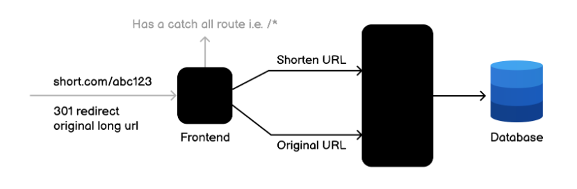

# URL Shortening Service

API for url shortening. This is a solution
of [URL Shortening Service](https://roadmap.sh/projects/url-shortening-service)
project [roadmap.sh](https://roadmap.sh)

API should provide endpoints to create, retrieve, update, and delete short URLs. It should
also provide statistics on the number of times a short URL has been accessed



## 🛠️ Technologies

- Java 17 or higher
- Maven
- PostgreSQL 16.3

### 📖 API Documentation

This project uses **Swagger** to document the REST API built with Spring Boot.  
Once the application is running, you can access the Swagger UI at:
http://localhost:8095/swagger-ui.html

## 🚀 Usage

Follow these steps to run the application locally:

1. **Clone the repository**
   ```bash
   git clone https://github.com/L-ux-es/URLShorteningService.git
   cd URLShorteningService

2. Define the required variables at [.env](.env) file

Below are the environment variables you can define in the `.env` file to configure the application:

| Variable      | Description                                                                         |
|---------------|-------------------------------------------------------------------------------------|
| `DB_URL`      | Full database connection URL (including host, port, database name, and parameters). |
| `DB_NAME`     | Name of the database to be used.                                                    |
| `DB_USERNAME` | Username to access the database.                                                    |
| `DB_PASSWORD` | Password for the database user.                                                     |

3. Build the project with Maven

```bash
mvn clean install
````

4. Run the application

```bash
mvn spring-boot:run
```

5. Access the API Once the application is running, the API will be available at:
   http://localhost:8095/shorten

## 🙏 Acknowledgments

This project was inspired and guided by external resources that helped me understand the concepts behind URL shortening.  
Special thanks to **ByteByteGo** for their excellent educational content:

- [ByteByteGo – System Design: URL Shortening](https://youtu.be/HHUi8F_qAXM)  


